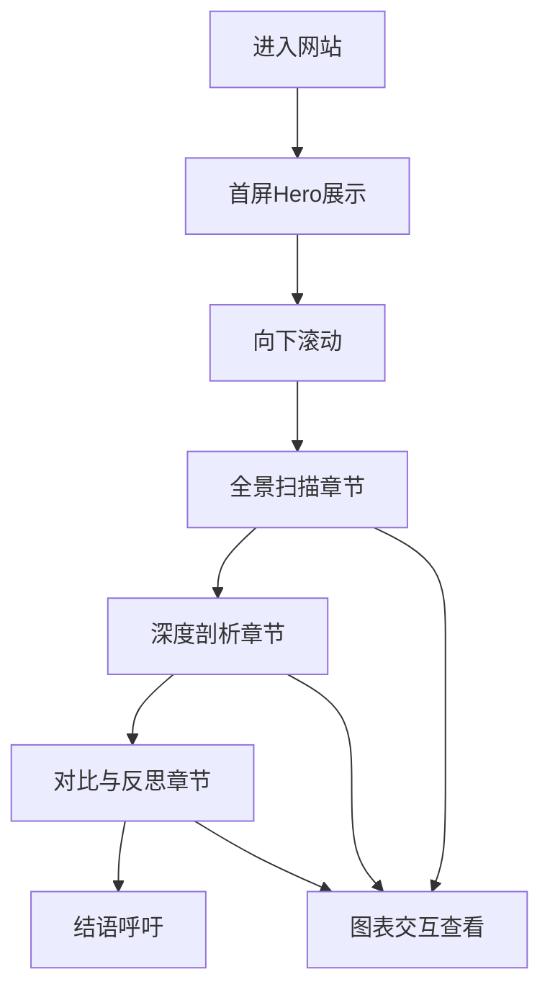

# 数据新闻网站 - 产品需求文档

## 1. 产品概述
一个以"城市不平，穿梭平安"为主题的交互式数据新闻网站，通过丰富的数据可视化图表，全景展示中国城市夜间劳动者的规模、分布、工作强度、收入待遇与权益保障现状。

## 2. 核心功能

### 2.1 功能模块
1. **首屏英雄区**：大标题、副标题、导语，营造数据新闻氛围
2. **全景扫描章节**：群体规模、行业分布、空间分布
3. **深度剖析章节**：工作强度、收入与补贴、健康与权益
4. **对比与反思章节**：横向对比、纵向对比、保障反思
5. **结语呼吁**：致敬夜间劳动者，行动呼吁

### 2.2 页面详情
| 章节 | 模块 | 功能描述 |
|-----|------|---------|
| 首屏 | Hero区 | 大标题动画、背景动效、滚动提示 |
| 全景扫描 | 群体规模 | 关键数据展示 + 横向柱状图（七大行业人数分布） |
| 全景扫描 | 行业分布 | 纵向柱状图（七大行业夜间从业占比） |
| 全景扫描 | 空间分布 | 城市密度排名条形图 |
| 深度剖析 | 工作强度 | 关键指标卡片 + 柱状图对比 |
| 深度剖析 | 收入补贴 | 收入数据 + 行业薪资排名 |
| 深度剖析 | 健康权益 | 风险数据可视化 |
| 对比反思 | 横向对比 | 城市占比排名图 |
| 对比反思 | 纵向对比 | 折线图（2019-2025规模增长） |
| 对比反思 | 保障反思 | 饼图（权益保障缺口分析） |
| 结语 | 呼吁区 | 致敬文案 + 行动号召 |

## 3. 核心流程
用户打开网站 → 首屏动画 → 向下滚动浏览各章节 → 图表渐入动画 → 交互查看数据 → 到达结语

## 4. 用户界面设计

### 4.1 设计风格
- **配色**：深色主题 (#0a0a12 主背景) + 渐变强调色 (#e94560 主色, #00d4ff 辅助色, #ffd700 高亮色)
- **字体**：Noto Sans SC (正文) + 思源黑体 Bold (标题)
- **布局**：长页面滚动式，居中布局，章节分明
- **动效**：滚动渐入动画、数字滚动动画、图表渐入动画、视差效果

### 4.2 页面设计
| 章节 | 模块 | UI元素 |
|-----|------|-------|
| 首屏 | Hero | 超大标题、渐变文字、背景光点、滚动箭头 |
| 全景扫描 | 数据卡片 | 大数字 + 单位 + 说明文字，渐变色背景 |
| 全景扫描 | 柱状图 | 深色背景 + 渐变色柱体 + 数据标签 |
| 深度剖析 | 对比图 | 双柱对比、数据高亮 |
| 对比反思 | 折线图 | 平滑曲线、渐变填充、数据点 |
| 对比反思 | 饼图 | 环形饼图、图例说明 |
| 结语 | 呼吁区 | 居中大字、按钮、温暖色调 |

### 4.3 响应式设计
- 桌面端：最大宽度1200px居中
- 平板端：自适应宽度，图表缩小
- 移动端：单列布局，图表全屏展示
