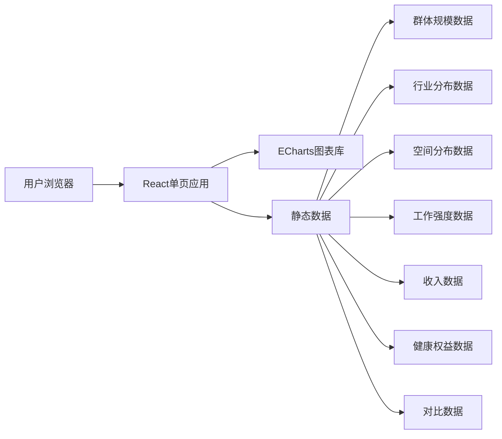

# 数据新闻网站 - 技术架构文档

## 1. 架构设计



## 2. 技术选型
- **前端框架**：React@18 + Vite
- **样式方案**：Tailwind CSS
- **图表库**：ECharts 5
- **图标库**：Lucide React
- **动效**：CSS动画 + 滚动监听
- **部署方式**：静态文件部署

## 3. 路由定义
| 路由 | 用途 |
|-----|------|
| / | 数据新闻长页面 |

## 4. 组件结构
```
App
└── Home (主页面)
    ├── HeroSection (首屏英雄区)
    ├── SectionTitle (章节标题组件)
    ├── StatCard (数据卡片组件)
    ├── IndustryBarChart (行业分布柱状图)
    ├── CityRankChart (城市排名条形图)
    ├── WorkIntensityChart (工作强度图)
    ├── IncomeChart (收入对比图)
    ├── HealthRadarChart (健康雷达图)
    ├── GrowthLineChart (增长折线图)
    ├── SecurityPieChart (保障饼图)
    └── ConclusionSection (结语呼吁)
```

## 5. 数据模型

### 5.1 群体规模
```typescript
interface ScaleData {
  min: number;      // 规模下限(万)
  max: number;      // 规模上限(万)
  transportRatio: number; // 交通运输占比
}
```

### 5.2 行业分布
```typescript
interface IndustryData {
  name: string;
  nightWorkers: number; // 夜间从业人数
  ratio: number;        // 夜间从业占比
}
```

### 5.3 城市分布
```typescript
interface CityData {
  name: string;
  density: number; // 密度(人/平方公里)
}
```

### 5.4 工作强度
```typescript
interface WorkIntensityData {
  dailyHours: number;    // 日均工作时长
  weeklyDays: number;    // 每周工作天数
  monthlyRest: number;   // 每月休息天数
  multiJobRatio: number; // 多份工作占比
}
```

### 5.5 收入数据
```typescript
interface IncomeData {
  average: number;       // 月均收入
  highestIndustry: string; // 最高行业
  lowestIndustry: string;  // 最低行业
}
```

### 5.6 健康数据
```typescript
interface HealthData {
  sleepDisorder: number;
  digestive: number;
  anxiety: number;
  cardiovascular: number;
}
```
